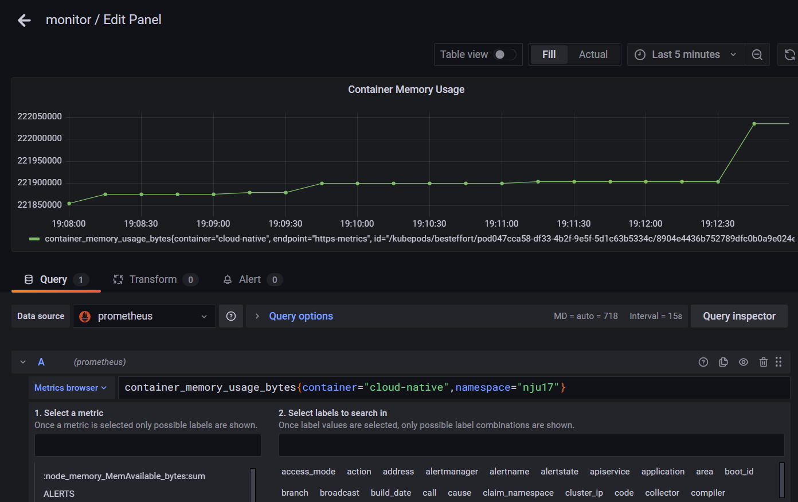
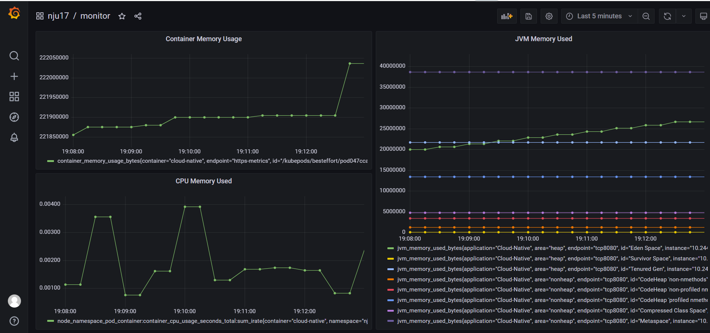
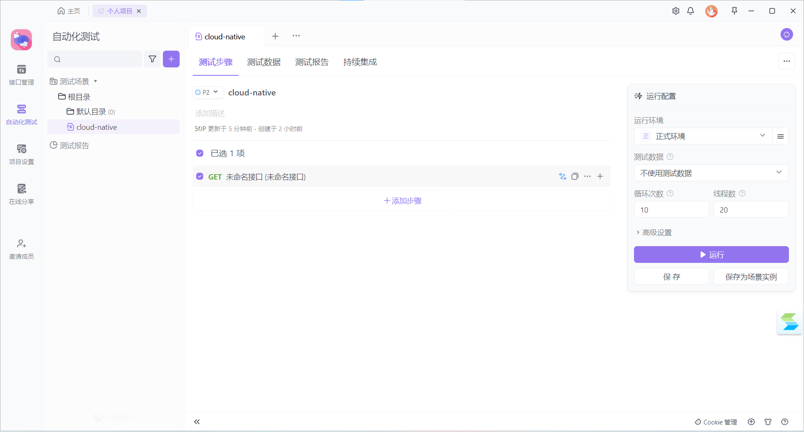

# 第17组 云原生大作业说明文档

## 小组成员

| 姓名   | 学号      |
| ------ | --------- |
| 张铭铭 | 211250234 |
| 胡家睿 | 211250020 |
| 宋毅恒 | 211250022 |

## 功能说明

### 限流功能

### Dockerfile与K8s容器编排

dockerfile

deployment.yaml

monitor.yaml

相关注解在代码注释中

### Jenkins

### Grafana监控
&emsp;&emsp;流水线部署完成后，在软件研发效能支撑平台的grafana平台上可以直接查询到对应的容器和名空间。 
&emsp;&emsp;通过可视化工具可以直接创建所需的图表（如下图）。

通过此方式创建CPU、内存、JVM的空间使用图表（如下图）。

### 压力测试
&emsp;&emsp;在Apifox中添加实现的接口（如下图）。

&emsp;&emsp;使用Apifox的自动化测试功能,设置循环次数为10次，线程数为20(如下图)。

&emsp;&emsp;测试完成后可以查看grafana中容器内存使用有明显上升（由于网络限制测试时间花费较长，故没有触发限流）。

### 扩容场景
 