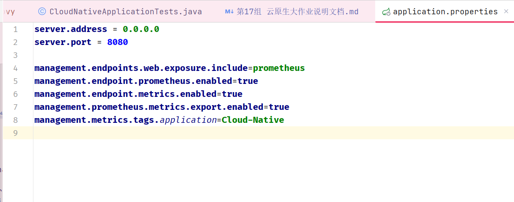
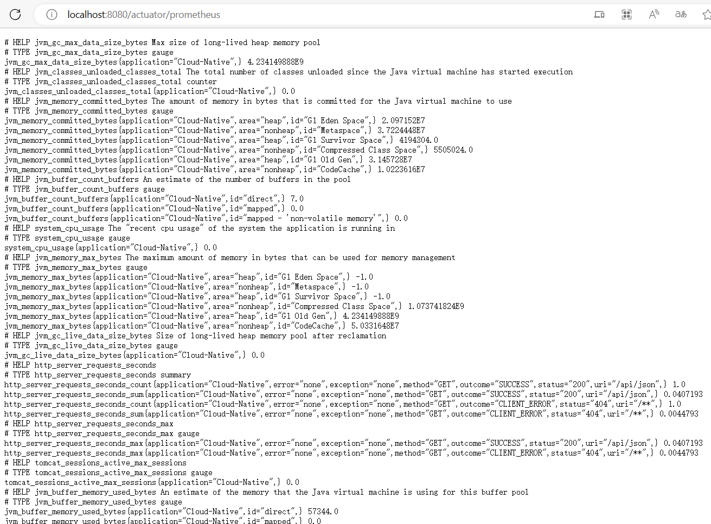
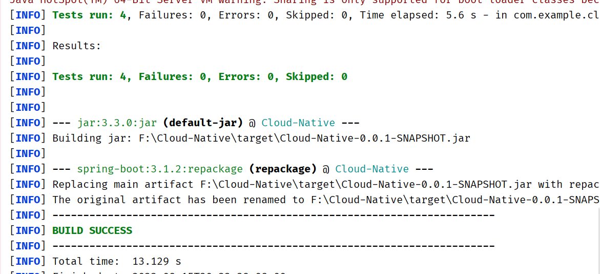
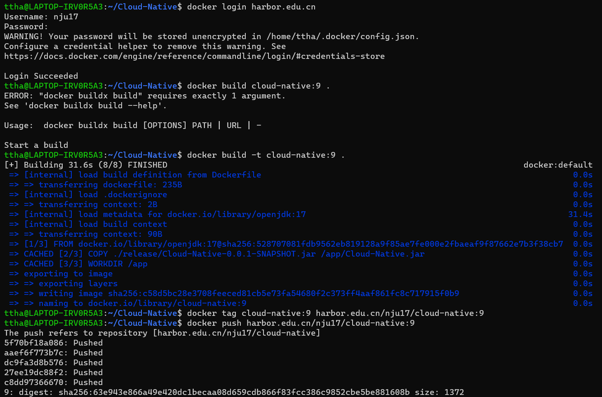
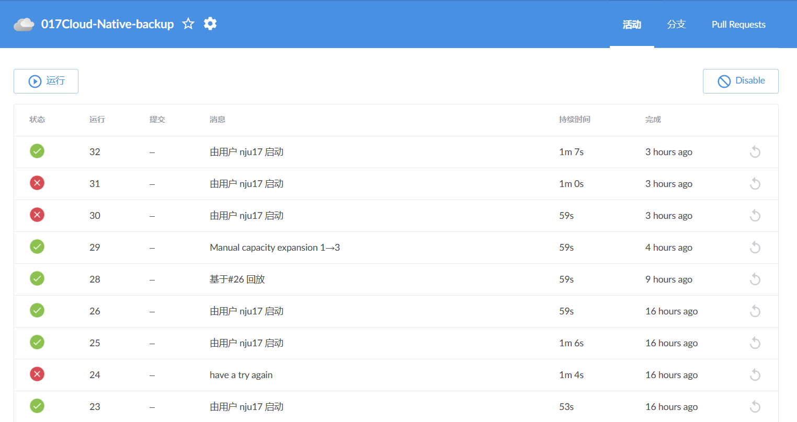
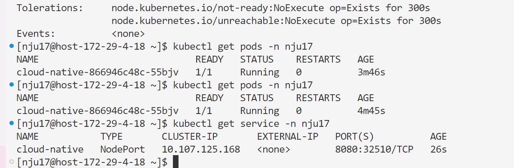
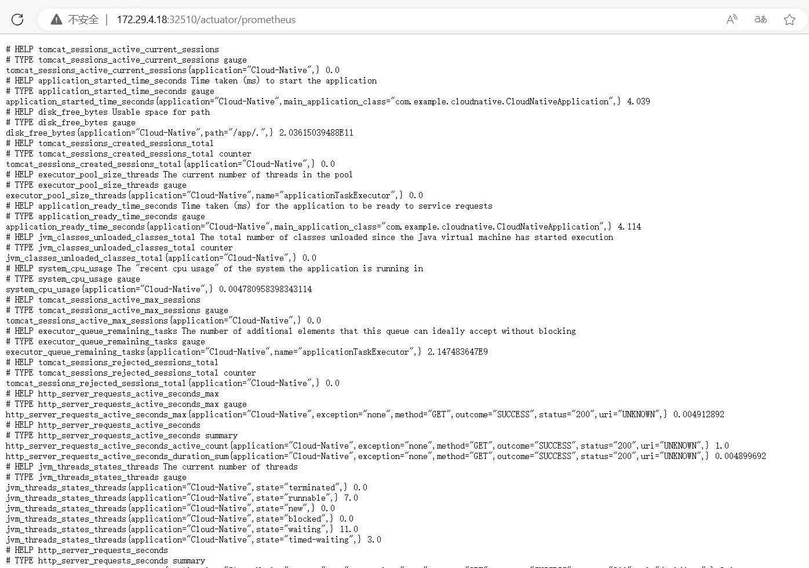
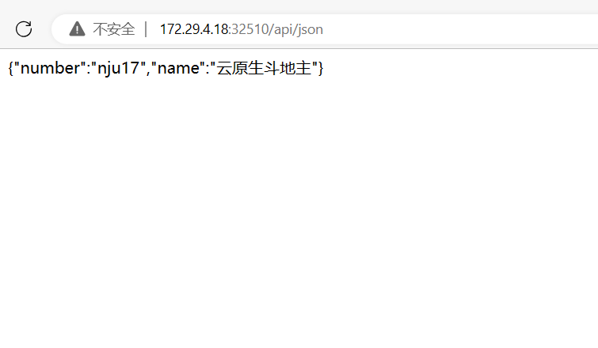

# 第17组 云原生大作业说明文档

## 小组成员

|    姓名    |     学号      |
|:--------:|:-----------:|
|   张铭铭    |  211250234  |
|   胡家睿    |  211250020  |
|   宋毅恒    |  211250022  |


## 功能要求

### 实现接口和限流功能

在项目中新建一个``Controller``，实现Rest接口如下：
```java
@RestController
public class DemoController {

    private final RateLimiter rateLimiter = RateLimiter.create(100.0);

    @GetMapping("/api/text")
    @ResponseStatus(HttpStatus.OK)
    @ResponseBody
    public String getText(){
        if(!rateLimiter.tryAcquire(1))
            throw new HttpStatusCodeException(HttpStatus.TOO_MANY_REQUESTS) {
            };
        return "{\"name\":\"云原生斗地主\",\"number\":\"nju17\"}";
    }

    @GetMapping( "/api/json")
    @ResponseStatus(HttpStatus.OK)
    @ResponseBody
    public String getJson() {
        if(!rateLimiter.tryAcquire(1)) {
            throw new HttpStatusCodeException(HttpStatus.TOO_MANY_REQUESTS) {};
        }
        JSONObject json = new JSONObject();
        try {
            json.put("name", "云原生斗地主");
            json.put("number", "nju17");
        } catch (JSONException e) {
            throw new RuntimeException(e);
        }
        String ret = json.toString();
        return ret;
    }
}
```
其中，限流功能使用了```RateLimiter```相关接口来实现，限制每秒最多处理100个请求。如果请求过于频繁，则会返回```429```错误，如下所示（使用```springboot test```测试）:

本地运行后，该接口可以通过访问```http://localhost:8080/api/json``` 或 ```http://localhost:8080/api/text``` 来测试可用性：


### 实现Prometheus监控
在项目的application.properties中添加如下配置：

并在pom.xml中添加相关依赖：
```xml
<dependency>
    <groupId>io.micrometer</groupId>
    <artifactId>micrometer-registry-prometheus</artifactId>
    <version>1.7.0</version>
</dependency>
```
本地运行后，即可在```http://localhost:8080/actuator/prometheus``` 中查看到相关监控信息：


### 统一限流

统一限流暂未实现~

## DevOps 要求

### Dockerfile与K8s容器编排

- Dockerfile
  
- deployment.yaml
  
- monitor.yaml
  

相关注解在代码注释中。截图中的代码适配下述方案二流水线，在Jenkins部分会进行说明。

### Jenkins

由于软院Jenkins服务器的master节点一直被占用，因此我们原本做好的Jenkin流水线无法运行，后来临时做了另一条流水线。两套方案如下：

- 方案一：原本的Jenkin流水线方案，同时使用了master节点和slave节点进行构建，其中master节点完成了持续集成的功能，slave节点完成了持续部署的功能。流水线如下：
```groovy
pipeline {
    agent none
    stages {
        stage('Clone Code') {
            agent {
                label 'master'
            }
            steps {
                echo "1.Clone From Gitee"
                sh 'curl "http://p.nju.edu.cn/portal_io/login?' +
                        'username=' + '211250234' +
                        '&' +
                        'password=' + 'xxxxxxx' + '"' //密码已隐藏
                git url: 'https://gitee.com/irisalt/cloud-native.git', branch: 'main'
            }
        }

        stage('Maven Build') {
            agent {
                docker {
                    image 'maven:latest'
                    args ' -v /root/.m2:/root/.m2'
                }
            }
            steps {
                echo "2. Using Maven to Build"
                sh 'mvn -B clean package'
            }
        }

        stage('Build Image') {
            agent {
                label 'master'
            }
            steps {
                echo "3. Build Image"
                sh 'docker build -t cloud-native:${BUILD_ID} .'
                sh 'docker tag cloud-native:${BUILD_ID} harbor.edu.cn/nju17/cloud-native:${BUILD_ID}'
            }
        }

        stage('Push Image') {
            agent {
                label 'master'
            }
            steps {
                echo "4. Push Docker Image"
                sh 'docker login harbor.edu.cn ' +
                        '-u ' + 'nju17' +
                        ' -p ' + 'nju172023'
                sh 'docker push harbor.edu.cn/nju17/cloud-native:${BUILD_ID}'
            }
        }
    }
}

node('slave') {
    container('jnlp-kubectl') {
        stage('Clone & Change YAML') {
            echo "5. Clone YAML to Slave and Change YAML"
            //xxx needs to be replaced
            sh 'curl "http://p.nju.edu.cn/portal_io/login?' +
                    'username=' + '211250234' +
                    '&' +
                    'password=' + 'xxxxxxx' + '"' //密码已隐藏
            git url: 'https://gitee.com/irisalt/cloud-native.git', branch: 'main'
            sh 'sed -i "s#{VERSION}#${BUILD_ID}#g" deployment.yaml'
        }

        stage ('Deploy') {
            echo "6. Deploy to K8s"
            //xxx needs to be replaced
            sh 'curl "http://p.nju.edu.cn/portal_io/login?' +
                    'username=' + '211250234' +
                    '&' +
                    'password=' + 'xxxxxxx' + '"' //密码已隐藏
            sh 'docker login harbor.edu.cn ' +
                        '-u ' + 'nju17' +
                        ' -p ' + 'nju172023'
            sh 'docker pull harbor.edu.cn/nju17/cloud-native:${BUILD_ID}'
            sh 'kubectl apply -f deployment.yaml -n nju17'
        }

        stage('Monitor') {
            echo "7. Start Monitor"
            sh 'kubectl apply -f monitor.yaml -n monitoring'
        }
    }
}
```
  master节点完成了代码上传，镜像构建，上传到镜像仓库的任务。此外在Maven构建时，已经通过了本地写好的单元测试，如下所示：
    
  编写的单元测试代码如下：
```java
@SpringBootTest
class CloudNativeApplicationTests {
	private DemoController demoController = new DemoController();
	private static final String EXPECTED_TEXT = "{\"name\":\"云原生斗地主\",\"number\":\"nju17\"}";
	@BeforeEach
	void initAll() {demoController = new DemoController();}
	@Test
	void testGetText() { // 测试可用性
		String result = demoController.getText();
		assert(result.equals(EXPECTED_TEXT));
	}
	@Test
	void test429(){ // 测试限流功能，应该爆429并且通过测试
		try {
			for(int i = 0; i < 100; i++) {
				Thread.sleep(5);
				demoController.getText();
			}
			assert false;
		} catch (Exception e) {
			assert(e.getMessage().equals("429 TOO_MANY_REQUESTS"));
		}
	}
	@Test
	void test429Two(){ // 测试限流功能，应该爆429并且通过测试
		try {
			for(int i = 0; i < 100; i++) {
				demoController.getText();
			}
			assert false;
		} catch (Exception e) {
			assert(e.getMessage().equals("429 TOO_MANY_REQUESTS"));
		}
	}
	@Test
	void testEdge(){ // 边界测试，应该表现为不会爆429
		try {
			for(int i = 0; i < 100; i++) {
				Thread.sleep(11);
				demoController.getText();
			}
			assert true;
		} catch (Exception e) {
			if(e.getMessage().equals("429 TOO_MANY_REQUESTS")){
				assert false;
			};
			assert true;
		}
	}
}
```

- 方案二：由于准备开始构建流水线的时候master节点都用不了，因此得修改流水线。这是因为master节点和slave节点的功能是不一样的，经过本人测试，在slave节点上我们无法使用``mvn`` ``docker``等命令（应该是没有预装相关的环境）。因此小组同时使用了另一套方案：
  - 在本地手动将docker镜像上传到镜像仓库，并手动指定TAG：
    
    - 构建流水线如下，该流水线实际上实现了持续部署的功能：
      ```groovy
      pipeline {
        agent none
        stages {
            stage('Clone Code') {
                agent {
                    label 'slave'
                }
                steps {
                    echo "1.Clone From Gitee"
                    //xxx needs to be replaced
                    sh 'curl "http://p.nju.edu.cn/portal_io/login?' +
                            'username=' + '211250234' +
                            '&' +
                            'password=' + 'xxxxxxx' + '"' //密码已隐藏
                    git url: 'https://gitee.com/irisalt/cloud-native.git', branch: 'main'
                }
            }
        }
      }
    
      node('slave') {
      container('jnlp-kubectl') {
      stage('Clone & Change YAML') {
      echo "2. Clone YAML to Slave and Change YAML"
      //xxx needs to be replaced
      sh 'curl "http://p.nju.edu.cn/portal_io/login?' +
      'username=' + '211250234' +
      '&' +
      'password=' + 'xxxxxxx' + '"' //密码已隐藏
      git url: 'https://gitee.com/irisalt/cloud-native.git', branch: 'main'
      }

          stage ('Deploy') {
              echo "3. Deploy to K8s"
              //xxx needs to be replaced
              sh 'curl "http://p.nju.edu.cn/portal_io/login?' +
                      'username=' + '211250234' +
                      '&' +
                      'password=' + 'xxxxxxx' + '"' //密码已隐藏
              sh 'docker login harbor.edu.cn ' +
                      '-u ' + 'nju17' +
                      ' -p ' + 'nju172023'
              sh 'docker pull harbor.edu.cn/nju17/cloud-native:9'
              // sh 'kubectl delete deployment cloud-native -n nju17'
              sh 'kubectl apply -f deployment.yaml -n nju17'
              // sh 'kubectl scale deployment cloud-native --replicas 1 -n nju17'
          }

          stage('Monitor') {
              echo "4. Start Monitor"
              sh 'kubectl apply -f monitor.yaml -n monitoring'
          }
        }
      }
    ```
    
实际运行的情况如下，访问的url为``http://172.29.4.18:32510/`` ：





## 扩容场景

### Grafana监控
&emsp;&emsp;流水线部署完成后，在软件研发效能支撑平台的grafana平台上可以直接查询到对应的容器和名空间。<br/>
&emsp;&emsp;通过可视化工具可以直接创建所需的图表（如下图）。

通过此方式创建CPU、内存、JVM的空间使用图表（如下图）。


### 压力测试
&emsp;&emsp;在Apifox中添加实现的接口（如下图）。

&emsp;&emsp;使用Apifox的自动化测试功能,设置循环次数为10次，线程数为20(如下图)。

&emsp;&emsp;测试完成后可以查看grafana中容器内存使用有明显上升（由于网络限制测试时间花费较长，故没有触发限流）。


 