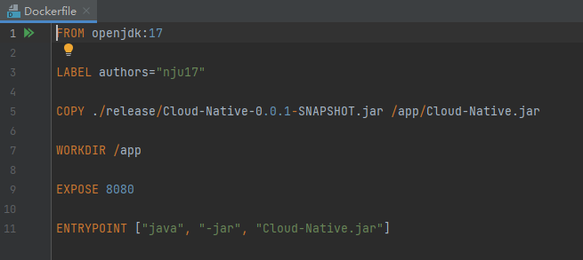
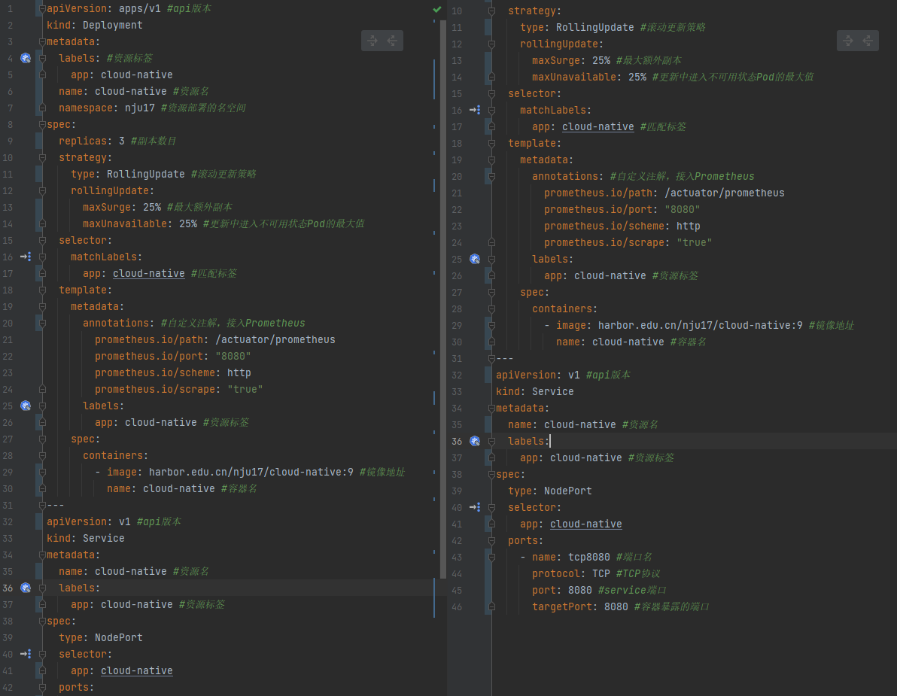
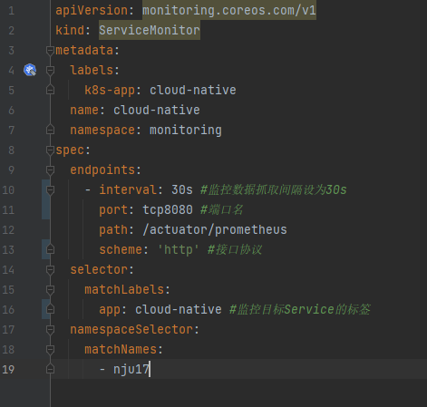

# 第17组 云原生大作业说明文档

## 小组成员

| 姓名   | 学号      |
| ------ | --------- |
| 张铭铭 | 211250234 |
| 胡家睿 | 211250020 |
| 宋毅恒 | 211250022 |

## 功能说明

### 限流功能

### Dockerfile与K8s容器编排

dockerfile

deployment.yaml

monitor.yaml

相关注解在代码注释中

### Jenkins

### Grafana监控

### 压力测试

