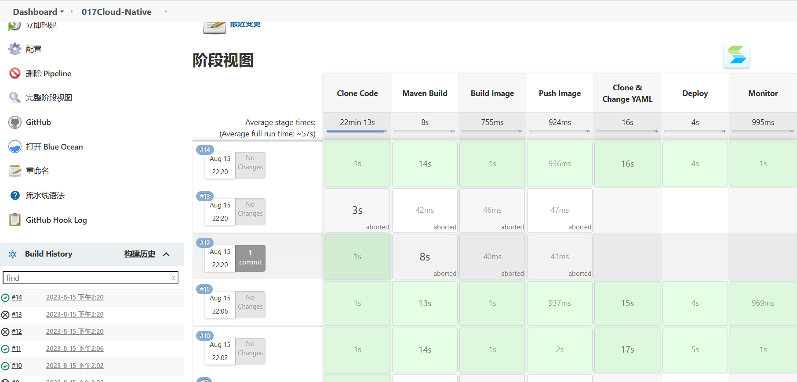
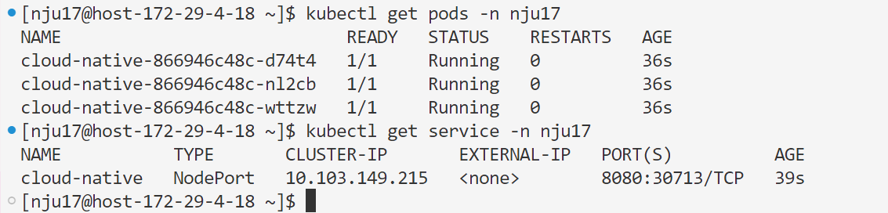
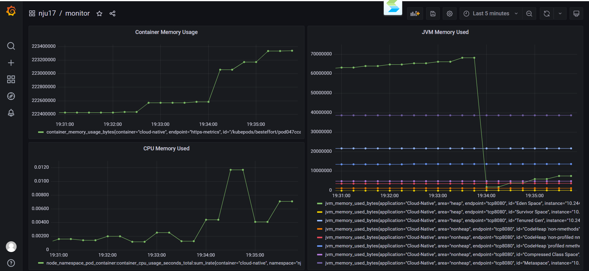
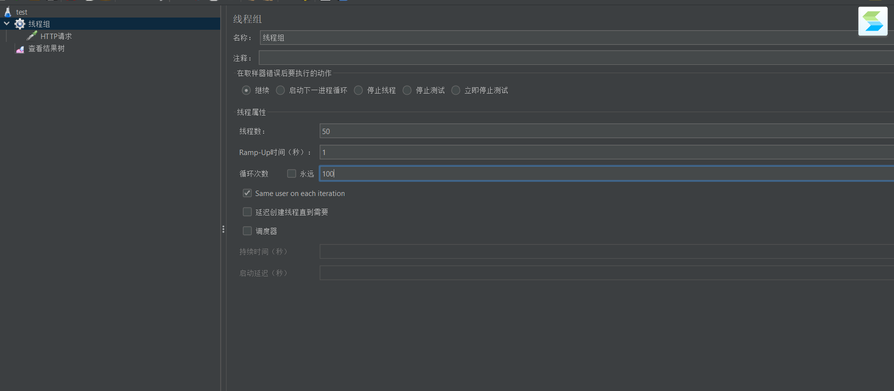
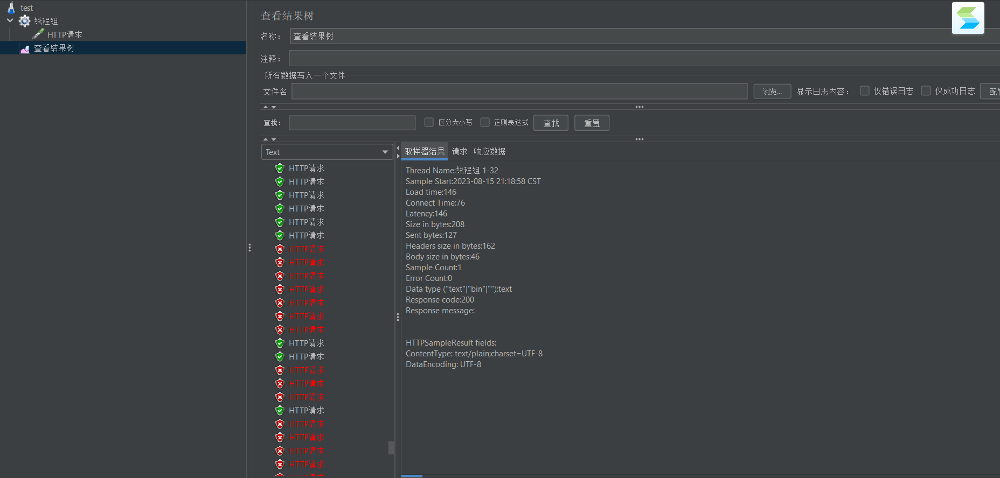
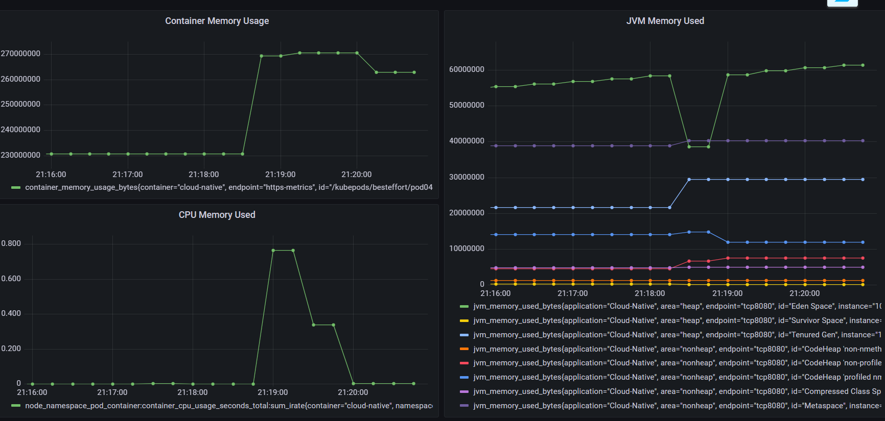
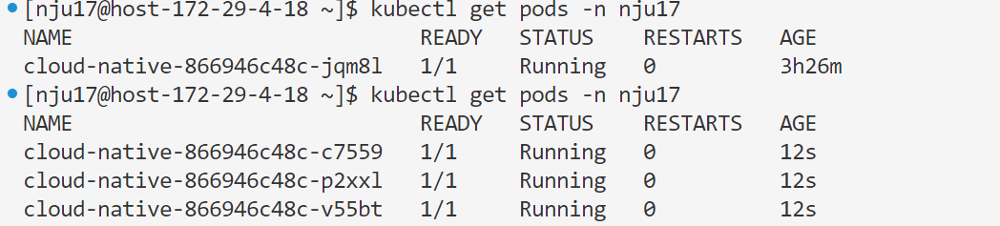
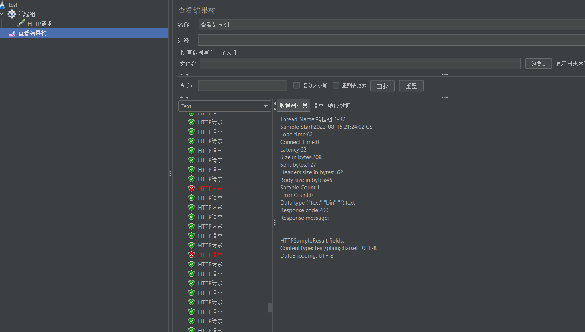
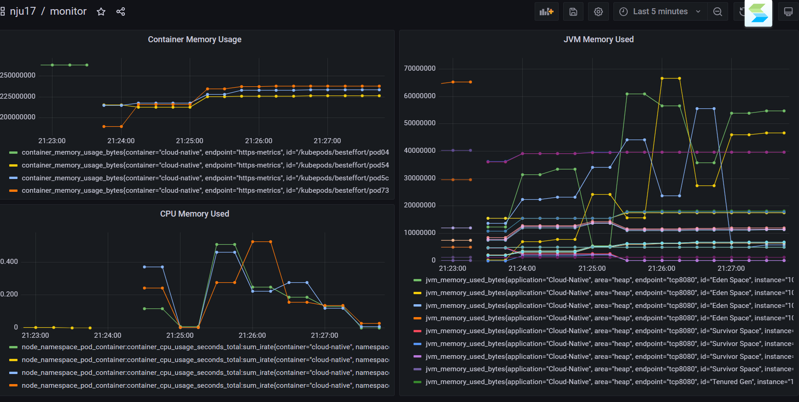
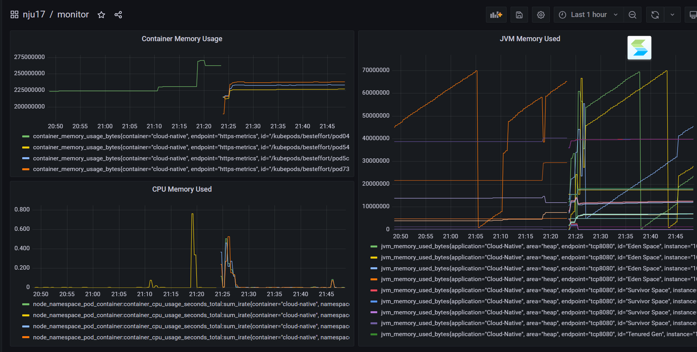

# 第17组 云原生大作业说明文档

> 云原生斗地主 GROUP nju17

项目地址：

👉👉👉[github](https://github.com/T-THA/Cloud-Native)

👉👉👉[gitee](https://gitee.com/irisalt/cloud-native)

## 小组成员

|    姓名    |     学号      |
|:--------:|:-----------:|
|   张铭铭    |  211250234  |
|   胡家睿    |  211250020  |
|   宋毅恒    |  211250022  |


## 功能要求

### **实现接口和限流功能**

在项目中新建一个``Controller``，实现Rest接口如下：
```java
@RestController
public class DemoController {

    private final RateLimiter rateLimiter = RateLimiter.create(100.0);

    @GetMapping("/api/text")
    @ResponseStatus(HttpStatus.OK)
    @ResponseBody
    public String getText(){
        if(!rateLimiter.tryAcquire(1))
            throw new HttpStatusCodeException(HttpStatus.TOO_MANY_REQUESTS) {
            };
        return "{\"name\":\"云原生斗地主\",\"number\":\"nju17\"}";
    }

    @GetMapping( "/api/json")
    @ResponseStatus(HttpStatus.OK)
    @ResponseBody
    public String getJson() {
        if(!rateLimiter.tryAcquire(1)) {
            throw new HttpStatusCodeException(HttpStatus.TOO_MANY_REQUESTS) {};
        }
        JSONObject json = new JSONObject();
        try {
            json.put("name", "云原生斗地主");
            json.put("number", "nju17");
        } catch (JSONException e) {
            throw new RuntimeException(e);
        }
        String ret = json.toString();
        return ret;
    }
}
```
其中，限流功能使用了```RateLimiter```相关接口来实现，限制每秒最多处理100个请求。如果请求过于频繁，则会返回```429```错误，如下所示（使用```springboot test```测试）:

本地运行后，该接口可以通过访问```http://localhost:8080/api/json``` 或 ```http://localhost:8080/api/text``` 来测试可用性：


### **实现Prometheus监控**
在项目的application.properties中添加如下配置：

并在pom.xml中添加相关依赖：
```xml
<dependency>
    <groupId>org.springframework.boot</groupId>
    <artifactId>spring-boot-starter-actuator</artifactId>
</dependency>
<dependency>
    <groupId>io.micrometer</groupId>
    <artifactId>micrometer-registry-prometheus</artifactId>
</dependency>
```
本地运行后，即可在```http://localhost:8080/actuator/prometheus``` 中查看到相关监控信息：


### **统一限流**

统一限流暂未实现~

## DevOps 要求

### **Dockerfile与K8s容器编排**

- Dockerfile
  
- deployment.yaml
  

相关注解在代码注释中。截图中的代码适配下述方案二流水线，在Jenkins部分会进行说明。

下述部分是另外一套文件，适配方案一流水线：
- Dockerfile
  
- deployment.yaml 仅修改图示部分
  

### **Jenkins**

由于软院Jenkins服务器的master节点一直被占用，因此我们原本做好的Jenkin流水线无法运行，后来临时做了另一条流水线。结果后面master节点又正常工作，又成功运行了原本的方案。两套方案如下：

- 方案一：原本的Jenkin流水线方案，同时使用了master节点和slave节点进行构建，其中master节点完成了持续集成的功能，slave节点完成了持续部署的功能。流水线如下：
```groovy
pipeline {
    agent none
    stages {
        stage('Clone Code') {
            agent {
                label 'master'
            }
            steps {
                echo "1.Clone From Gitee"
                sh 'curl "http://p.nju.edu.cn/portal_io/login?' +
                        'username=' + '211250234' +
                        '&' +
                        'password=' + 'xxxxxxx' + '"' //密码已隐藏
                git url: 'https://gitee.com/irisalt/cloud-native.git', branch: 'main'
            }
        }

        stage('Maven Build') {
            agent {
                docker {
                    image 'maven:latest'
                    args ' -v /root/.m2:/root/.m2'
                }
            }
            steps {
                echo "2. Using Maven to Build"
                sh 'mvn -B clean package'
            }
        }

        stage('Build Image') {
            agent {
                label 'master'
            }
            steps {
                echo "3. Build Image"
                sh 'docker build -t cloud-native:${BUILD_ID} .'
                sh 'docker tag cloud-native:${BUILD_ID} harbor.edu.cn/nju17/cloud-native:${BUILD_ID}'
            }
        }

        stage('Push Image') {
            agent {
                label 'master'
            }
            steps {
                echo "4. Push Docker Image"
                sh 'docker login harbor.edu.cn ' +
                        '-u ' + 'nju17' +
                        ' -p ' + 'nju172023'
                sh 'docker push harbor.edu.cn/nju17/cloud-native:${BUILD_ID}'
            }
        }
    }
}

node('slave') {
    container('jnlp-kubectl') {
        stage('Clone & Change YAML') {
            echo "5. Clone YAML to Slave and Change YAML"
            //xxx needs to be replaced
            sh 'curl "http://p.nju.edu.cn/portal_io/login?' +
                    'username=' + '211250234' +
                    '&' +
                    'password=' + 'xxxxxxx' + '"' //密码已隐藏
            git url: 'https://gitee.com/irisalt/cloud-native.git', branch: 'main'
            sh 'sed -i "s#{VERSION}#${BUILD_ID}#g" deployment.yaml'
        }

        stage ('Deploy') {
            echo "6. Deploy to K8s"
            //xxx needs to be replaced
            sh 'curl "http://p.nju.edu.cn/portal_io/login?' +
                    'username=' + '211250234' +
                    '&' +
                    'password=' + 'xxxxxxx' + '"' //密码已隐藏
            sh 'docker login harbor.edu.cn ' +
                        '-u ' + 'nju17' +
                        ' -p ' + 'nju172023'
            sh 'docker pull harbor.edu.cn/nju17/cloud-native:${BUILD_ID}'
            sh 'kubectl apply -f deployment.yaml -n nju17'
        }

        stage('Monitor') {
            echo "7. Start Monitor"
            sh 'kubectl apply -f monitor.yaml -n monitoring'
        }
    }
}
```
  slave节点完成了从镜像仓库拉取镜像，部署到K8s集群的任务。在部署时，会自动修改deployment.yaml文件中的镜像TAG，以实现持续部署的功能。

  master节点完成了代码上传，镜像构建，上传到镜像仓库的任务。此外在Maven构建时，已经通过了本地写好的单元测试，如下所示：
    
  编写的单元测试代码如下：
  ```java
  @SpringBootTest
  class CloudNativeApplicationTests {
      private DemoController demoController = new DemoController();
      private static final String EXPECTED_TEXT = "{\"name\":\"云原生斗地主\",\"number\":\"nju17\"}";
      @BeforeEach
      void initAll() {demoController = new DemoController();}
      @Test
      void testGetText() { // 测试可用性
          String result = demoController.getText();
          assert(result.equals(EXPECTED_TEXT));
      }
      @Test
      void test429(){ // 测试限流功能，应该爆429并且通过测试
          try {
              for(int i = 0; i < 100; i++) {
                  Thread.sleep(5);
                  demoController.getText();
              }
              assert false;
          } catch (Exception e) {
              assert(e.getMessage().equals("429 TOO_MANY_REQUESTS"));
          }
      }
      @Test
      void test429Two(){ // 测试限流功能，应该爆429并且通过测试
          try {
              for(int i = 0; i < 100; i++) {
                  demoController.getText();
              }
              assert false;
          } catch (Exception e) {
              assert(e.getMessage().equals("429 TOO_MANY_REQUESTS"));
          }
      }
      @Test
      void testEdge(){ // 边界测试，应该表现为不会爆429
          try {
              for(int i = 0; i < 100; i++) {
                  Thread.sleep(11);
                  demoController.getText();
              }
              assert true;
          } catch (Exception e) {
              if(e.getMessage().equals("429 TOO_MANY_REQUESTS")){
                  assert false;
              };
              assert true;
          }
      }
  }
  ```

  流水线构建结果如下：
    
     


- 方案二：由于准备开始构建流水线的时候master节点都用不了，因此得修改流水线。这是因为master节点和slave节点的功能是不一样的，经过本人测试，在slave节点上我们无法使用``mvn`` ``docker``等命令（应该是没有预装相关的环境）。因此小组同时使用了另一套方案：
  - 在本地手动将docker镜像上传到镜像仓库，并手动指定TAG：
    
  - 构建流水线如下，该流水线实际上实现了持续部署的功能：
    ```groovy
    pipeline {
      agent none
      stages {
          stage('Clone Code') {
              agent {
                  label 'slave'
              }
              steps {
                  echo "1.Clone From Gitee"
                  //xxx needs to be replaced
                  sh 'curl "http://p.nju.edu.cn/portal_io/login?' +
                          'username=' + '211250234' +
                          '&' +
                          'password=' + 'xxxxxxx' + '"' //密码已隐藏
                  git url: 'https://gitee.com/irisalt/cloud-native.git', branch: 'main'
              }
          }
      }
    }
    
    node('slave') {
    container('jnlp-kubectl') {
    stage('Clone & Change YAML') {
    echo "2. Clone YAML to Slave and Change YAML"
    //xxx needs to be replaced
    sh 'curl "http://p.nju.edu.cn/portal_io/login?' +
    'username=' + '211250234' +
    '&' +
    'password=' + 'xxxxxxx' + '"' //密码已隐藏
    git url: 'https://gitee.com/irisalt/cloud-native.git', branch: 'main'
    }

        stage ('Deploy') {
            echo "3. Deploy to K8s"
            //xxx needs to be replaced
            sh 'curl "http://p.nju.edu.cn/portal_io/login?' +
                    'username=' + '211250234' +
                    '&' +
                    'password=' + 'xxxxxxx' + '"' //密码已隐藏
            sh 'docker login harbor.edu.cn ' +
                    '-u ' + 'nju17' +
                    ' -p ' + 'nju172023'
            sh 'docker pull harbor.edu.cn/nju17/cloud-native:9'
            // sh 'kubectl delete deployment cloud-native -n nju17'
            sh 'kubectl apply -f deployment.yaml -n nju17'
            // sh 'kubectl scale deployment cloud-native --replicas 1 -n nju17'
        }

        stage('Monitor') {
            echo "4. Start Monitor"
            sh 'kubectl apply -f monitor.yaml -n monitoring'
        }
      }
    }
    ```
    
实际运行的情况如下，访问的url为``http://172.29.4.18:32510/`` ：


## 扩容场景

### **Prometheus metrics接口**
配置一个ServiceMonitor，用于监控应用的metrics接口，访问的url为``http://172.29.4.18:32510/actuator/prometheus``，配置如下图所示：


### **Grafana监控**
流水线部署完成后，在软件研发效能支撑平台的grafana平台上可以直接查询到对应的容器和名空间。<br/>
通过可视化工具可以直接创建所需的图表（如下图）。

通过此方式创建CPU、内存、JVM的空间使用图表（如下图）。


### **压力测试**

- 使用Apifox进行压力测试

  在Apifox中添加实现的接口（如下图）。
  
  使用Apifox的自动化测试功能,设置循环次数为10次，线程数为20(如下图)。
  
  测试完成后可以查看grafana中容器内存使用有明显上升（由于网络限制测试时间花费较长，故没有触发限流）。
  
  

- 使用Apache JMeter进行压力测试
  
  由于ApiFox的测试时间较长，没有达到理想的效果，故再采用Apache JMeter进行压力测试。
  
  测试完成后可以看到出现了429错误，说明限流功能正常。
  
  查看监控大屏，大屏出现了明显的资源占用上升：
  

### **手工扩容**

可以修改deployment.yaml文件中replicas的值，再次部署。此处采取修改流水线的方式，直接修改Deploy阶段，增加对replicas的修改：
```groovy
// 其余部分省流

stage ('Deploy') {
    echo "3. Deploy to K8s"
    sh 'curl "http://p.nju.edu.cn/portal_io/login?' +
            'username=' + '211250234' +
            '&' +
            'password=' + 'xxxxxxx' + '"' //密码已隐藏
    sh 'docker login harbor.edu.cn ' +
            '-u ' + 'nju17' +
            ' -p ' + 'nju172023'
    sh 'docker pull harbor.edu.cn/nju17/cloud-native:9'
    // sh 'kubectl delete deployment cloud-native -n nju17'
    sh 'kubectl apply -f deployment.yaml -n nju17'
     sh 'kubectl scale deployment cloud-native --replicas 3 -n nju17'
}
```
增加``sh 'kubectl scale deployment cloud-native --replicas 3 -n nju17'``即可在部署时实现扩容，扩容结果如下。

扩容后，再次对接口进行压力测试，可以看到压力测试的结果如下，请求成功的次数大大增加：

监控大屏也可以观察到相应的变化，container变为3个，曲线呈上升趋势：

扩容前后对比：

 
### **自动扩容**

自动扩容不写了~
